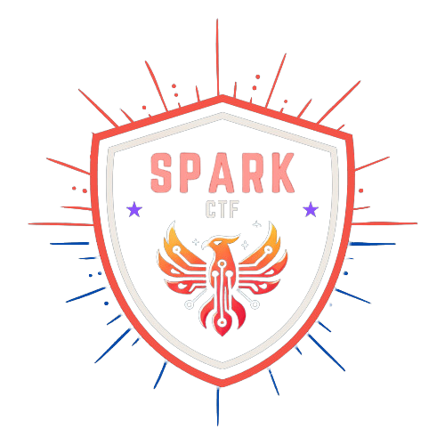

    

<h1 align="center">
    SparkCTF 2024
</h1>

    SparkCTF 2024 is a jeopardy-style CTF competition, designed for Year 1 to Year 3 Cybersecurity &amp; Digtal Forensics students to sharpen their skills and demonstrate their ability to quickly adapt and learn concepts within the time constraint of a regular CTF. There are over 60+ challenges spanning across multiple 6 categories!
      
    The CTF commenced on 17 December 2024 at 0900 hours and concluded on 18 December 2024 at 2100 hours, with 36 hours to complete all of these challenges!

 

<h1 align="center">
    Challenge Statistics
</h1>

    Click on the blue links to navigate around this repository.

## Difficulty Distribution

| Category | Easy | Medium | Hard | Insane | Total |
| -------- |:----:|:------:|:----:|:------:|:-----:|
| [Crypto](challenges/crypto) | 9 | 2 | 2 | 0 | 13 (19.4%) |
| [Forensics](challenges/forensics) | 5 | 6 | 1 | 2 | 14 (20.9%) |
| [Misc](challenges/misc) | 8 | 6 | 1 | 0 | 15 (22.4%) |
| [Osint](challenges/osint) | 3 | 3 | 1 | 0 | 7 (10.4%) |
| [Pwn](challenges/pwn) | 4 | 1 | 0 | 1 | 6 (9.0%) |
| [Web](challenges/web) | 6 | 4 | 1 | 1 | 12 (17.9%) |
| Total | 35 | 22 | 6 | 4 | 67 |

## Challenges

Here are all[^2] of the challenges writeups and solutions[^1] that were in the SparkCTF 2024 competition.

| Name | Category | Difficulty | Author |
| ---- | -------- | ---------- | ------ |
| [Baker 1 - Let me Cook!](challenges/crypto/Baker1_LetMeCook) | [crypto](challenges/crypto) | Easy | Gavin |
| [Cipher Fun! - Flag 1](challenges/crypto/CipherFun1) | [crypto](challenges/crypto) | Easy | Zhen Xiang |
| [Cipher Fun! - Flag 2](challenges/crypto/CipherFun2) | [crypto](challenges/crypto) | Easy | Zhen Xiang |
| [Decode How Many Times? - Flag 1](challenges/crypto/DecodeHowManyTimes1) | [crypto](challenges/crypto) | Easy | Zhen Xiang |
| [Hidden in Plain Sight - Flag 1](challenges/crypto/HiddenInPlainSight1) | [crypto](challenges/crypto) | Easy | Zhen Xiang |
| [Hidden in Plain Sight - Flag 2](challenges/crypto/HiddenInPlainSight2) | [crypto](challenges/crypto) | Easy | Zhen Xiang |
| [rth_secure_a - Flag 1](challenges/crypto/rth_secure_a1) | [crypto](challenges/crypto) | Easy | Zhen Xiang |
| [What The Binary - Flag 1](challenges/crypto/WhatTheBinary1) | [crypto](challenges/crypto) | Easy | Zhen Xiang |
| [What The Binary - Flag 2](challenges/crypto/WhatTheBinary2) | [crypto](challenges/crypto) | Easy | Zhen Xiang |
| [Baker 2 - Am I Cooking This Right...?](challenges/crypto/Baker2_AmICooking) | [crypto](challenges/crypto) | Medium | Gavin |
| [Decode How Many Times? - Flag 2](challenges/crypto/DecodeHowManyTimes2) | [crypto](challenges/crypto) | Medium | Zhen Xiang |
| [rth_secure_a - Flag 2](challenges/crypto/rth_secure_a2) | [crypto](challenges/crypto) | Hard | Zhen Xiang |
| [The Image is a What??? - Flag 4](challenges/crypto/TheImageIsAWhat4) | [crypto](challenges/crypto) | Hard | Zhen Xiang |
| [Baking Soda](challenges/forensics/BakingSoda) | [forensics](challenges/forensics) | Easy | Zhen Xiang |
| [Finding The Flag](challenges/forensics/FindingTheFlag) | [forensics](challenges/forensics) | Easy | Zhen Xiang |
| [Grocery List - Flag 1](challenges/forensics/GroceryList1) | [forensics](challenges/forensics) | Easy | Zhen Xiang |
| [The Image is a What??? - Flag 1](challenges/forensics/TheImageIsAWhat1) | [forensics](challenges/forensics) | Easy | Zhen Xiang |
| [This does not SOUND good - Flag 1](challenges/forensics/ThisDoesNotSoundGood1) | [forensics](challenges/forensics) | Easy | Zhen Xiang |
| [Grocery List - Flag 2](challenges/forensics/GroceryList2) | [forensics](challenges/forensics) | Medium | Zhen Xiang |
| [Lets Hash It Out!](challenges/forensics/LetsHashItOut) | [forensics](challenges/forensics) | Medium | Zhen Xiang |
| [Psss... Psss...](challenges/forensics/PsssPsss) | [forensics](challenges/forensics) | Medium | Justin |
| [The Image is a What??? - Flag 2](challenges/forensics/TheImageIsAWhat2) | [forensics](challenges/forensics) | Medium | Justin |
| [The Image is a What??? - Flag 3](challenges/forensics/TheImageIsAWhat3) | [forensics](challenges/forensics) | Medium | Zhen Xiang |
| [This does not SOUND good - Flag 2](challenges/forensics/ThisDoesNotSoundGood2) | [forensics](challenges/forensics) | Medium | Zhen Xiang |
| [Counting Flags](challenges/forensics/CountingFlags) | [forensics](challenges/forensics) | Hard | Zhen Xiang |
| [Baking Binary - Final Flag (Hybrid Challenge)](challenges/forensics/BakingBinary) | [forensics](challenges/forensics) | Insane | Zhen Xiang |
| [This does not SOUND good - Flag 3](challenges/forensics/ThisDoesNotSoundGood3) | [forensics](challenges/forensics) | Insane | Zhen Xiang |
| [Fun In The Discord!](challenges/misc/FunInDiscord) | [misc](challenges/misc) | Easy | Zhen Xiang & Gavin |
| [Play It To Win It - Flag 1](challenges/misc/PlayItToWinIt1) | [misc](challenges/misc) | Easy | Joseph |
| [Play It To Win It - Flag 2](challenges/misc/PlayItToWinIt2) | [misc](challenges/misc) | Easy | Joseph |
| [Play It To Win It - Flag 3](challenges/misc/PlayItToWinIt3) | [misc](challenges/misc) | Easy | Joseph |
| [Welcome to Linux - Flag 1](challenges/misc/WelcomeToLinux1) | [misc](challenges/misc) | Easy | Zhen Xiang |
| [Welcome to Linux - Flag 2](challenges/misc/WelcomeToLinux2) | [misc](challenges/misc) | Easy | Zhen Xiang |
| [Welcome to Linux - Flag 3](challenges/misc/WelcomeToLinux3) | [misc](challenges/misc) | Easy | Zhen Xiang |
| [Why Do You Do This...](challenges/misc/WhyDoYouDoThis) | [misc](challenges/misc) | Easy | Zhen Xiang |
| [A-1000 - Flag 1](challenges/misc/A1000-1) | [misc](challenges/misc) | Medium | Zhen Xiang |
| [A-1000 - Flag 2](challenges/misc/A1000-2) | [misc](challenges/misc) | Medium | Zhen Xiang |
| [Free Roadblockers](challenges/misc/FreeRoadblockers) | [misc](challenges/misc) | Medium | Zhen Xiang |
| [Guess The Flag](challenges/misc/GuessTheFlag) | [misc](challenges/misc) | Medium | Sayed Hamzah |
| [Play It To Win It - Flag 4](challenges/misc/PlayItToWinIt4) | [misc](challenges/misc) | Medium | Joseph |
| [Running Inc](challenges/misc/RunningInc) | [misc](challenges/misc) | Medium | Zhen Xiang |
| [Kena RFed](challenges/misc/KenaRFed) | [misc](challenges/misc) | Hard | Sayed Hamzah |
| [After Macs - Flag 2](challenges/osint/AfterMacs2) | [osint](challenges/osint) | Easy | Zhen Xiang |
| [Honey In School](challenges/osint/HoneyInSchool) | [osint](challenges/osint) | Easy | Justin |
| [Jolly Holiday](challenges/osint/JollyHoliday) | [osint](challenges/osint) | Easy | Justin |
| [After Macs - Flag 1](challenges/osint/AfterMacs1) | [osint](challenges/osint) | Medium | Zhen Xiang |
| [A Sigma Boomer](challenges/osint/ASigmaBoomer) | [osint](challenges/osint) | Medium | Zhen Xiang |
| [Power Capping](challenges/osint/PowerCapping) | [osint](challenges/osint) | Medium | Zhen Xiang |
| [Finding Tiffany](challenges/osint/FindingTiffany) | [osint](challenges/osint) | Hard | Justin |
| [FMT Yallz](challenges/pwn/fmt_yallz) | [pwn](challenges/pwn) | Easy | Sayed Hamzah |
| [Pwnie Warmup](challenges/pwn/PwnieWarmup) | [pwn](challenges/pwn) | Easy | Sayed Hamzah |
| [Pwnie Up](challenges/pwn/pwnie_up) | [pwn](challenges/pwn) | Easy | Sayed Hamzah |
| [Spark Console - Flag 1](challenges/pwn/sparkconsole1) | [pwn](challenges/pwn) | Easy | Zhen Xiang |
| [Overflow Me](challenges/pwn/overflowme) | [pwn](challenges/pwn) | Medium | Sayed Hamzah |
| [Spark Console - Flag 2](challenges/pwn/sparkconsole2) | [pwn](challenges/pwn) | Insane | Zhen Xiang |
| [Admin Page - Flag 1](challenges/web/AdminPage1) | [web](challenges/web) | Easy | Zhen Xiang |
| [Admin Page - Flag 2](challenges/web/AdminPage2) | [web](challenges/web) | Easy | Zhen Xiang |
| [ess_ess_elle](challenges/web/ess_ess_elle) | [web](challenges/web) | Easy | Sayed Hamzah |
| [HTML Analysis - Flag 1](challenges/web/HTMLAnalysis1) | [web](challenges/web) | Easy | Zhen Xiang |
| [I'm Insecure](challenges/web/ImInsecure) | [web](challenges/web) | Easy | Gavin |
| [Secret Surprise Terrified Igloo 1](challenges/web/SecretSurpriseTerrifiedIgloo1) | [web](challenges/web) | Easy | Zhen Xiang |
| [Admin Page - Flag 3](challenges/web/AdminPage3) | [web](challenges/web) | Medium | Zhen Xiang |
| [Admin Page - Flag 4](challenges/web/AdminPage4) | [web](challenges/web) | Medium | Zhen Xiang |
| [Fun In the Disco](challenges/web/FunInTheDisco) | [web](challenges/web) | Medium | Zhen Xiang |
| [Just What's Tampered?](challenges/web/Just_Whats_Tampered-1) | [web](challenges/web) | Medium | Gavin |
| [HTML Analysis - Flag 2](challenges/web/HTMLAnalysis2) | [web](challenges/web) | Hard | Zhen Xiang |
| [Secret Surprise Terrified Igloo 2](challenges/web/SecretSurpriseTerrifiedIgloo2) | [web](challenges/web) | Insane | Zhen Xiang |

> [!NOTE]
> The service files for **'web'** and some **'misc'** challenges will not be provided for copyright reasons.

 
<h1 align="center">
    Contributions and Affiliations
</h1>

## Contributors

Thanks to these great people for supporting me in creating this Capture The Flag competition!

  <table>
    <tr>
      <td align="center" valign="top">
         
        <strong>Justin</strong> 
        Student in Cybersecurity &amp; Digital Forensics
      </td>
      <td align="center" valign="top">
         
        <strong>Gavin</strong> 
        Student in Cybersecurity &amp; Digital Forensics
      </td>
    </tr>
    <tr>
      <td align="center" valign="top">
         
        <strong>Sayed Hamzah</strong> 
        Lecturer in Cybersecurity &amp; Digital Forensics
      </td>
      <td align="center" valign="top">
         
        <strong>Joseph</strong> 
        Student in Immersive Media &amp; Game Development
      </td>
    </tr>
  </table>

## Affiliations

    <table>
        <tr>
          <td style="width: 60px; text-align: center;">
              
          </td>
          <td>
              <strong>Cybersecurity &amp; Digital Forensics</strong> 
              Student Interest Group (AY2024/2025 Batch)
          </td>
        </tr>
    </table>

[^1]: Challenges that have 0 solves will have their solutions withheld until further notice. Do note that the flag for these challenges are possible to obtain.
[^2]: Some challenges such as Sanity or Feedback challenges will **not** be included here.
