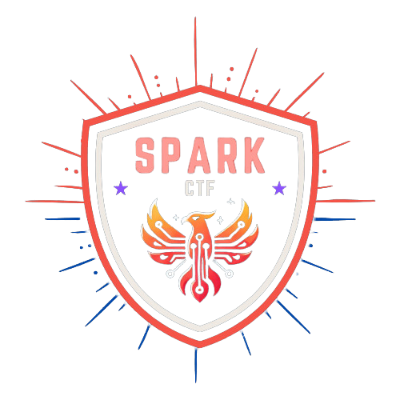

    

<h1 align="center">
    SparkCTF 2.0
</h1>

    SparkCTF 2.0 is a jeopardy-style CTF competition.  
    In this iteration, we have invited Year 1 Cybersecurity &amp; Digtal Forensics students to partake in this CTF. This allows them to sharpen their skills and demonstrate their ability to quickly adapt and learn concepts within the time constraint of a regular CTF.  
    There are 73 challenges spanning across 6 categories!
    The CTF commenced on 19 Dec 2025 at 0900 hours and concluded on 20 Dec at 2100 hours, with 36 hours to complete all of these challenges!

 

<h1 align="center">
    Challenge Statistics
</h1>

    Click on the blue links to navigate around this repository.

## Challenges

Here are all[^2] of the challenges writeups and solutions that were in the SparkCTF 2025 competition.

| Name | Category | Author |
| ---- | -------- | ------ |
| [67-factors](./crypto/67-factors) | [Crypto](./crypto) | Enzo |
| [Bacon Salad](./crypto/Bacon%20Salad) | [Crypto](./crypto) | Wei Qi |
| [Crypto-meme](./crypto/crypto-meme) | [Crypto](./crypto) | Enzo |
| [Double Trouble](./crypto/Double_Trouble) | [Crypto](./crypto) | Tiffany |
| [French Encryption](./crypto/French%20Encryption) | [Crypto](./crypto) | Hong Ann |
| [Romanized Encryption](./crypto/Romanized%20Encryption) | [Crypto](./crypto) | Hong Ann |
| [Saw Sages!](./crypto/Saw_Sages%21) | [Crypto](./crypto) | Enzo |
| [Scripty](./crypto/Scripty) | [Crypto](./crypto) | Kathleen |
| [Subbed In](./crypto/Subbed_In) | [Crypto](./crypto) | IAN (abcde4437) |
| [When Pigs Fly](./crypto/When%20Pigs%20Fly) | [Crypto](./crypto) | Si Xuan |
| [Behind The Image](./forensics/Behind%20The%20Image) | [Forensics](./forensics) | Hadriel |
| [BrowserFind](./forensics/BrowserFind) | [Forensics](./forensics) | Edwin |
| [Digital Footprints](./forensics/Digital%20Footprints) | [Forensics](./forensics) | Justin |
| [DORA The Explorer](./forensics/DORA-The-Explorer) | [Forensics](./forensics) | Edwin |
| [ForenSeek](./forensics/ForenSeek) | [Forensics](./forensics) | Tiffany |
| [Head Full of Kittens](./forensics/Head%20Full%20of%20Kitties) | [Forensics](./forensics) | Kathleen |
| [Hearing Visually](./forensics/Hearing%20Visually) | [Forensics](./forensics) | Enzo |
| [Hidden From PlainSight](./forensics/Hidden%20From%20PlainSight) | [Forensics](./forensics) | Hadriel |
| [Im Jager Baby!!!](./forensics/Im%20Jager%20Baby%21%21%21) | [Forensics](./forensics) | Justin |
| [MetaMystery](./forensics/MetaMystery) | [Forensics](./forensics) | Si Xuan |
| [Misplaced File Tragedy](./forensics/Misplaced%20File%20Tragedy) | [Forensics](./forensics) | Justin |
| [Password finding](./forensics/Password%20Finding) | [Forensics](./forensics) | Kathleen, Puikei |
| [Siew's Rescue](./forensics/Siew%27s%20Rescue) | [Forensics](./forensics) | Pui Kei |
| [Steg Bit by Bit](./forensics/Steg%20Bit%20by%20Bit) | [Forensics](./forensics) | Hadriel |
| [cryptrev](./misc/cryptrev) | [Misc](./misc) | Sayed Hamzah (@BaeSenseii) |
| [fANSI phrases](./misc/fANSI%20phrases) | [Misc](./misc) | Hong Ann |
| [GGibberish](./misc/GGibberish) | [Misc](./misc) | Ian Tay |
| [linrev_lvl1](./misc/linrev_lvl1) | [Misc](./misc) | Sayed Hamzah (@BaeSenseii) |
| [linrev_lvl2](./misc/linrev_lvl2) | [Misc](./misc) | Sayed Hamzah (@BaeSenseii) |
| [linrev_lvl3](./misc/linrev_lvl3) | [Misc](./misc) | Sayed Hamzah (@BaeSenseii) |
| [Pixel Puzzle](./misc/Pixel%20Puzzle) | [Misc](./misc) | Si Xuan |
| [Seri-ously?](./misc/Seri-ously) | [Misc](./misc) | Ian Tay |
| [SparkApp - 1](./misc/SparkApp%20-%201) | [Misc](./misc) | Sayed Hamzah (@BaeSenseii) |
| [SparkApp - 2](./misc/SparkApp%20-%202) | [Misc](./misc) | Sayed Hamzah (@BaeSenseii) |
| [SparkApp - 3](./misc/SparkApp%20-%203) | [Misc](./misc) | Sayed Hamzah (@BaeSenseii) |
| [SparkApp - 4](./misc/SparkApp%20-%204) | [Misc](./misc) | Sayed Hamzah (@BaeSenseii) |
| [SparkBot](./misc/SparkBot) | [Misc](./misc) | Gavin (@gavintjh) |
| [SparkMCP](./misc/sparkmcp) | [Misc](./misc) | Zhen Xiang |
| [The Whispering Manuscript](./misc/The%20Whispering%20Manuscript) | [Misc](./misc) | Aldric Liew |
| [What Do You Mean?](./misc/whatdoyoumean) | [Misc](./misc) | Sayed Hamzah (@BaeSenseii) |
| [winrev_lvl1](./misc/winrev_lvl1) | [Misc](./misc) | Sayed Hamzah (@BaeSenseii) |
| [winrev_lvl2](./misc/winrev_lvl2) | [Misc](./misc) | Sayed Hamzah (@BaeSenseii) |
| [winrev_lvl3](./misc/winrev_lvl3) | [Misc](./misc) | Sayed Hamzah (@BaeSenseii) |
| [BobaQuest](./osint/BobaQuest) | [OSINT](./osint) | Wei Qi |
| [Cellhunt](./osint/Cellhunt) | [OSINT](./osint) | Tiffany |
| [Date Night](./osint/Date_Night) | [OSINT](./osint) | Trixy Faure-Field |
| [Hidden Siew](./osint/Hidden%20Siew) | [OSINT](./osint) | Pui Kei |
| [Jarvis Is Lost!](./osint/Jarvis_Is_Lost) | [OSINT](./osint) | Trixy Faure-Field |
| [LostDNS](./osint/LostDNS) | [OSINT](./osint) | Edwin |
| [Past Times](./osint/Past%20Times) | [OSINT](./osint) | Enzo |
| [Ramen Hunt](./osint/Ramen%20Hunt) | [OSINT](./osint) | Justin |
| [Carnival](./pwn/Carnival) | [Pwn](./pwn) | Kurasama |
| [crashout](./pwn/crashout) | [Pwn](./pwn) | Sayed Hamzah (@BaeSenseii) |
| [hosehbo](./pwn/hosehbo) | [Pwn](./pwn) | Sayed Hamzah (@BaeSenseii) |
| [Roll The Dice](./pwn/Roll%20The%20Dice) | [Pwn](./pwn) | Kurasama |
| [SparkCLI Revamp](./pwn/sparkcli) | [Pwn](./pwn) | Zhen Xiang |
| [Type Fast](./pwn/Type_Fast) | [Pwn](./pwn) | Ian |
| [vanilla](./pwn/vanilla) | [Pwn](./pwn) | Sayed Hamzah (@BaeSenseii) |
| [Where's my Gadget?](./pwn/Where%27s%20my%20Gadget) | [Pwn](./pwn) | Kurasama |
| [Cookie Monster](./web/Cookie%20Monster) | [Web](./web) | Aldric Liew |
| [First Try Panic](./web/First%20Try%20Panic) | [Web](./web) | Joell |
| [Insecure about the Web](./web/InsecureAboutTheWeb) | [Web](./web) | IAN (abcde4437) |
| [Irrelavent Query](./web/Irrelevant%20Query) | [Web](./web) | Gavin (@gavintjh) |
| [More Than Meets The Eyes](./web/MoreThanMeetsTheEyes) | [Web](./web) | Ian Tay |
| [Private Notes](./web/privatenotes) | [Web](./web) | Zhen Xiang |
| [PROTOCOL SP4RK - 1](./web/protocolsp4rk-1) | [Web](./web) | Zhen Xiang |
| [PROTOCOL SP4RK - 2](./web/protocolsp4rk-2) | [Web](./web) | Zhen Xiang |
| [PROTOCOL SP4RK - 3](./web/protocolsp4rk-3) | [Web](./web) | Zhen Xiang |
| [Rendering Magic](./web/Rendering_Magic) | [Web](./web) | Enzo |
| [Tamesak University - 1](./web/Tamesak%20University%20-%201) | [Web](./web) | Joell |
| [Tamesak University - 2](./web/Tamesak%20University%20-%202) | [Web](./web) | Joell |
| [Text Summariser](./web/textsummariser) | [Web](./web) | Sayed Hamzah (@BaeSenseii) |
| [The Phantom Page](./web/The%20Phantom%20Page) | [Web](./web) | Aldric Liew |

> [!NOTE]
> The service files for **'web'** and some **'misc'** challenges will not be provided for copyright reasons.

 
<h1 align="center">
    Contributions and Affiliations
</h1>

[^1]: Some challenges such as Sanity or Feedback challenges will **not** be included here.
