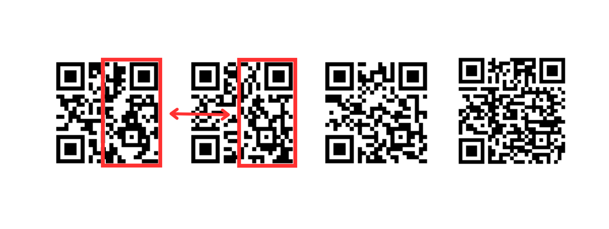
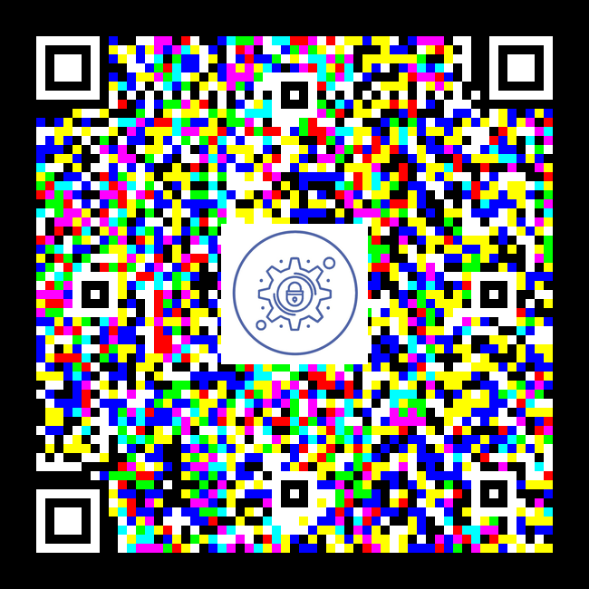

# Solution

## Step 1

The 3rd line in the [`totally_not_qr_code.txt`](../dist/totally_not_qr_code.txt) file consists of a binary string.
This binary string represents black and white squares in a square matrix, forming a QR Code.

A script is used to transform the binary string into a QR Code. 
[`binary_to_QR.py`](./step1/binary_to_QR.py)

The output gives the password to `step2.zip`

## Step 2

The 1st and 2nd QR Codes have been mixed and matched.

Fix the QR Codes manually using any software program that can be used to cut half of the 1st and 2nd QR codes and switch them.

Scanning all 3 QR codes (the last is a red harring) will yield the following:

1. 5Mumjy4Gp4ESMmjw5RSY5vYu0rF
2. 1bChQYXYtbjbAj24bEcgLN1f9wef4
3. S4n8D5SMKLdWF9DUykAgYHLm

Which when combined, gives the password to the `finale.zip`

## Finale

This is a QRGB QR Code, which stores data using RGB colors through layering, allowing for 3x more storage capacity compared to a regular QR Code.
(You can make use of CyberChef to separate it's RGB layers, or use the script below.)

Using the program `qrgb.py`, we can decode the QR Code. We get three QR codes, which yields:

- Red layer data: 010100110100100101000111001100100011010001111011010010000011000001010111010111110101010001001000001100110101111101001000001100110110110001001100

- Green layer data: 010111110110010000110001011001000101111101110101010111110110011100110011011101000101111101110100011010000011000101110011

- Blue layer data: 01011111011000110110111101101111010010110011001101100100010111110111010101010000010111110110011000110001011000010100011101111101

After decoding, will give the final flag to this challenge.