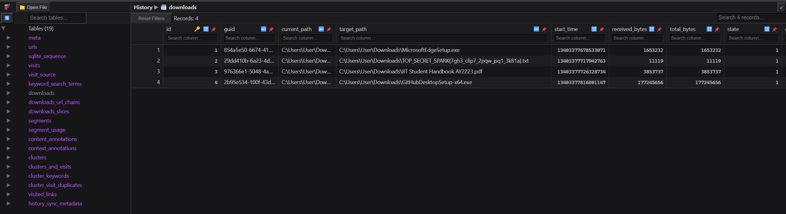

# BrowserFind - Solution Writeup

## Challenge Overview

Participants must analyze a Chrome browser profile to recover digital evidence hidden within browser artifacts. The challenge tests knowledge of Chrome forensics and SQLite database analysis.

## Solution Steps [Note there are more than 1 way to solve this challenge]:

### Step 1: Extract the Chrome Profile

Extract the provided `chrome_profile.zip` file to examine the Chrome profile structure:

```bash
unzip chrome_profile.zip
```

The extracted folder contains various Chrome browser files including:
- History (SQLite database)
- Preferences (JSON configuration)
- Web Data (SQLite database)
- Login Data (SQLite database)
- Other browser artifacts

### Step 2: Identify Key Forensic Artifacts

Chrome stores different types of data in various files:
- **History**: Browsing history, downloads, search terms
- **Web Data**: Autofill data, search engines, keywords
- **Login Data**: Saved passwords and usernames
- **Preferences**: Browser settings and configurations

For this investigation, focus on the `History` file as it contains download records.

### Step 3: Analyze the History Database

The `History` file is an SQLite database. Open it using an SQLite browser tool such as:
- https://sqliteviewer.app/

Load the `History` file and examine the database structure.

### Step 4: Examine the Downloads Table

Navigate to the `downloads` table within the History database. This table contains records of all files downloaded through Chrome.



Key columns in the downloads table include:
- `id`: Unique download identifier
- `current_path`: Current file location
- `target_path`: Intended file destination
- `start_time`: Download start timestamp
- `end_time`: Download completion timestamp
- `received_bytes`: File size downloaded
- `total_bytes`: Total file size
- `state`: Download status
- `url`: Source URL of the download

### Step 5: Search for Suspicious Downloads

Review the download records in the `target_path` and `current_path` columns to identify any files with suspicious or unusual names.

Look for entries that contain flag-like patterns or unusual naming conventions that might indicate hidden information.

### Step 6: Locate the Flag

Among the download records, identify the file with the suspicious name:

`TOP_SECRET_SPARK{7gh3_clip7_2pqw_jsq1_3k81a}.txt`

This filename contains the flag embedded within what appears to be a document name.

**Flag:** `SPARK{7gh3_clip7_2pqw_jsq1_3k81a}`

## Alternative Analysis Methods

### Method 1: Browser History Analysis

While not necessary for this challenge, participants could also examine:
- Browsing history in the `urls` table
- Search terms in the `keyword_search_terms` table
- Visited sites for additional context

## Key Learning Points

- Understanding Chrome browser profile structure and file organization
- Familiarity with SQLite database analysis tools and techniques
- Knowledge of where different browser artifacts are stored
- Practical digital forensics investigation methodology
- Recognition that browser downloads leave persistent traces in local databases
- Understanding that even "deleted" browser data may remain in forensic artifacts

