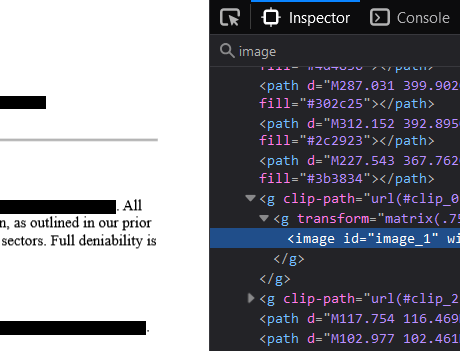

# Solution

1. First, convert the file from a PDF to a SVG file
2. Next, view the SVG using your browser of choice
3. Search for any elements of 'Images' in the HTML Inspect Element

5. Delete the image element to uncover another image

6. Within the image contains a text
```
$xvacLCb524Eb50A5707:=bN
```
7. Use ROT47 to get the flag