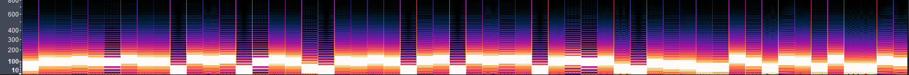

# Solution

1. The data is hidden in the audio file through the use of Frequency Modulation.

2. The boxes are visibly different every one second interval.
3. Grab the dominant frequency of each interval using the mathematical tool, FFT (Fast Fourier Transform).
4. The frequency numbers from every interval is then converted to ASCII characters, that forms the hidden message within the flag.
> The answer script is located here: [secret-decode.py](./secret-decode.py)