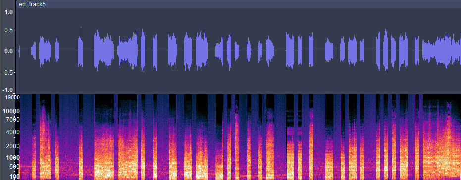

# Solution

### PART 2: AMPLITUDE MODULATION

10. This uses the same concept as the previous flag, encoding ASCII characters into the audio, but instead for amplitude.

11. Analysing the audio data reveals that some portions of the audio has lower amplitude while other parts have higher amplitudes.

12. Instead of taking the peak amplitude, we take the average amplitude of each interval, which is a second.

13. After that, compare it to a threshold of your choice based on your analysis of the amplitude. If the average amplitude is lesser or equal to the threshold, make it a bit '1', else '0'.

14. After that, transform the bit array to a byte array, then convert each byte into an ASCII character.

15. Combining the ASCII characters will give you the second half of the flag.

> [!IMPORTANT] Full Solution Hidden
> This challenge is flagged as a 0 solve challenge. The full solution will be withheld until further notice.