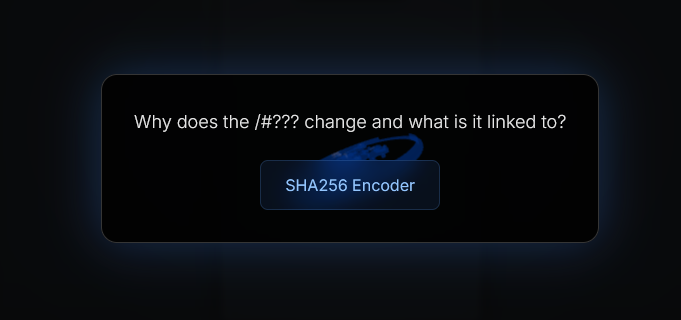
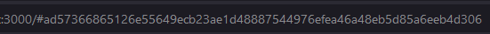
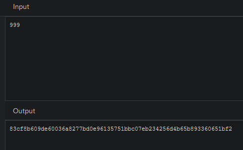
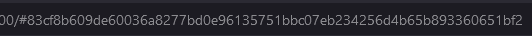
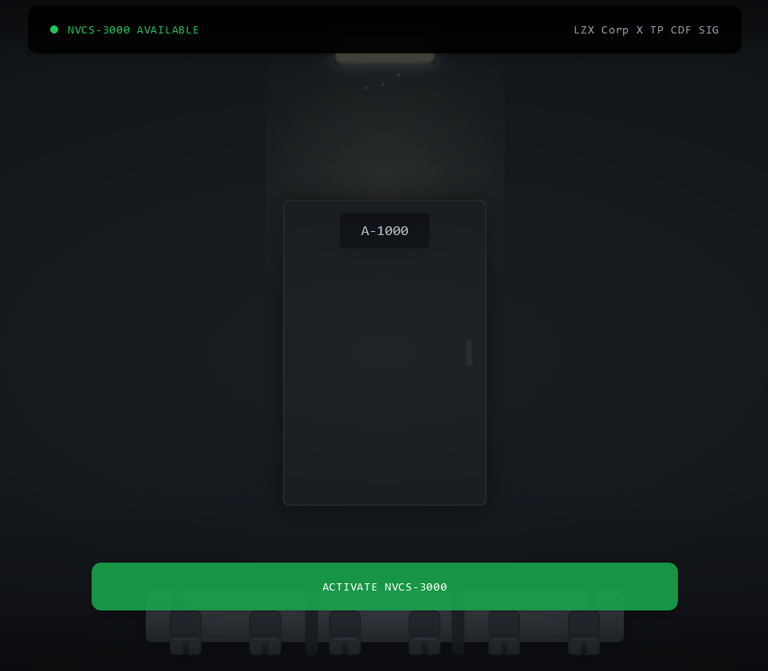
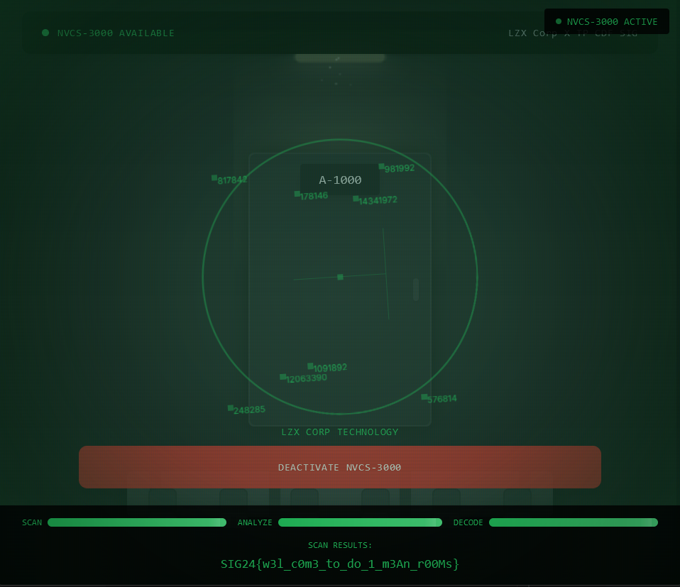

# Solution

1. Click on the Door to travel to the next room. Repeat this until you reach Room A-100

2. A hint will be presented at Room A-100 with a website for SHA256 encoding.

3. The path is actually linked to the Room the user is currently in. Let's say you are in Room A-290, the room number, '290', will be encoded into SHA256.

4. When using the hint web encoder, encode `999` and copy it as the path to skip all the way to Room A-999.

5. Once you reach A-1000, you will have received the special NVCS-3000 Available.

6. Activate the NVCS-3000 to get the 1st flag.
