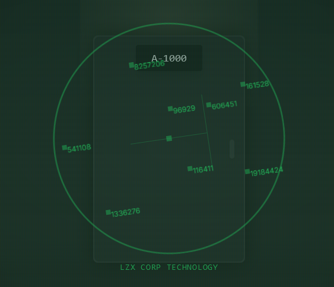
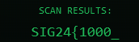
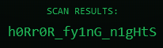
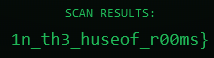

# Solution

1. Activate the NVCS-3000 tablet to show the Scanner.

2. The numbers shown on the tablet can actually be summed up together to get the special number


3. In this example, here is the maths done

```
8257206 + 161528 + 96929 + 606451 + 541108 + 116411 + 19184424 + 1336276 = 30300333
```

4. The number `30300333` can be separated into three distinct numbers, `30 300 333`. The numbers are locations of the Rooms that the flag fragments are located at.

5. Go to each room using the SHA265 Encoder and get the scan results of each

  

6. Combine the fragments based on the location of the brackets { } to get the flag.