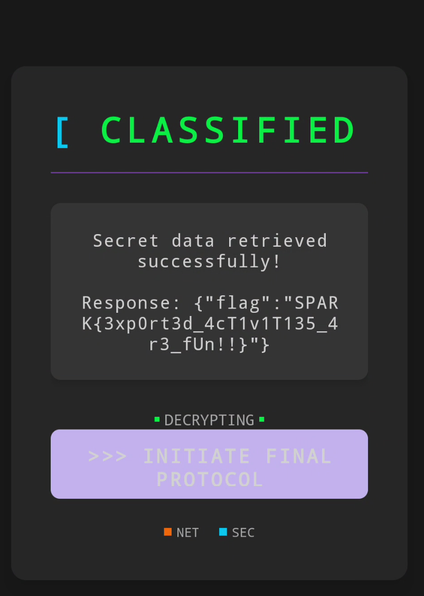

# Solution

If we take a look at the AndroidManifest.xml file, notice that there are 3 Android Activities that are exported out:

```xml
...
<activity android:exported="true" android:label="Secret Area" android:name="com.sparkctf.sparkapp.SecretActivity"/>
<activity android:exported="true" android:label="Another Secret Area" android:name="com.sparkctf.sparkapp.FinalActivity2"/>
<activity android:exported="true" android:label="SPARK{P3rm15510n5_f0r_1yf3}" android:name="com.sparkctf.sparkapp.FinalActivity" android:parentActivityName="com.sparkctf.sparkapp.SecretActivity"/>
...
```

For this challenge, you will need to launch the SecretActivity Android Activity. To do that, you will need to:
- Install the mobile application on an Android phone/emulator (as stated in the challenge description)
- Launch an ADB shell and run the following command:

```bash
am start -n com.sparkctf.sparkapp/com.sparkctf.sparkapp.SecretActivity
```

You should be able to see the flag in the next Activity:
