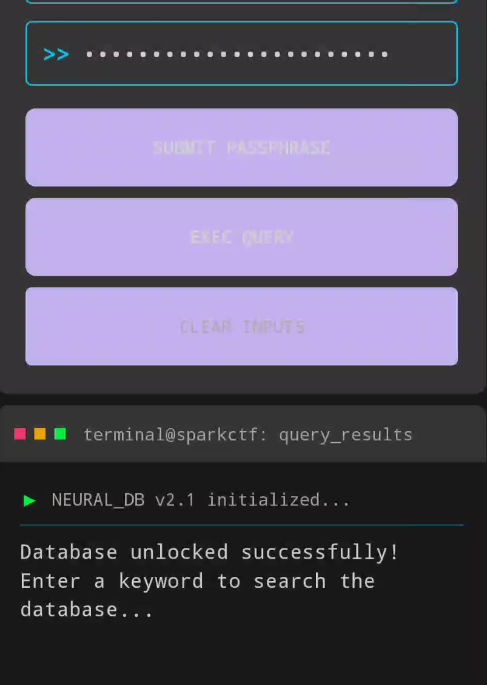
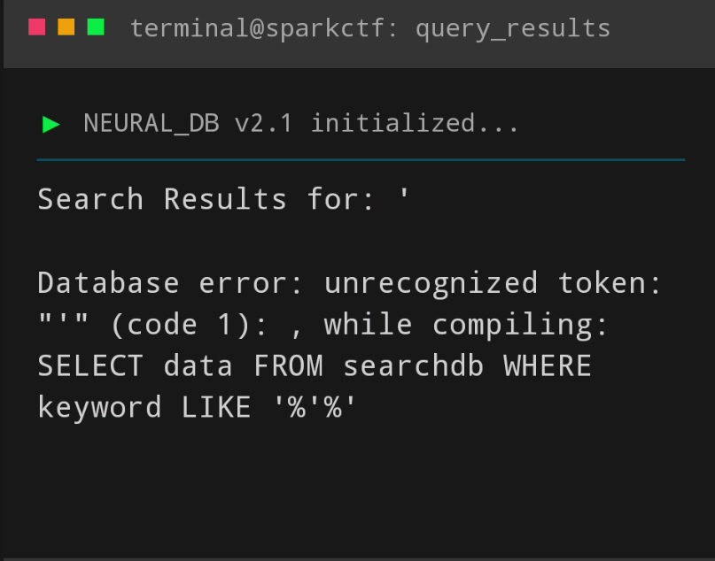
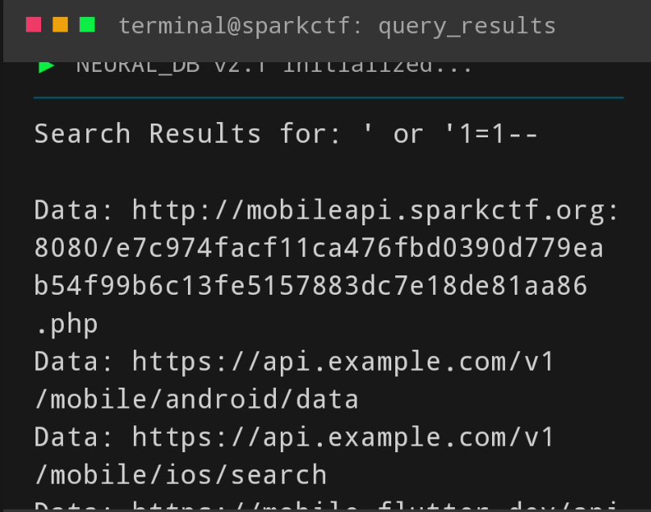
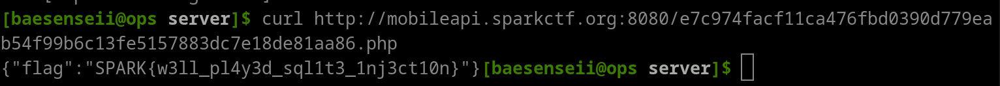

# Solution
There are two parts to solve in order to obtain the flag:
- Obtaining the passphrase to decrypt the SQLite Database
- Perform the SQL Injection

## SQLite Database Passphrase
Based on the first hint and the decompiled APK resources, navigate to the res/strings.xml file and you should see something like this:

```xml
...
<string name="secret_pt1">VGgzXzUzY3IzdF8</string>
<string name="secret_pt2">xNV8wdVRfVGgzcjMK</string>
...
```

Simply concatenate the two strings together (secret_pt1 + secret_pt2) and base64 decode it:

```bash
└─$ echo "VGgzXzUzY3IzdF8xNV8wdVRfVGgzcjMK" | base64 -d
Th3_53cr3t_15_0uT_Th3r3
```

Enter the passphrase into the Android application (followed by pressing the 'Submit Passphrase' button) and you should be able to see something like this:



## SQL Injection Attack (Simple one :))
If we take a look at either the smali code (from apktool) or jadx, under the DatabaseHelper class, you'll probably see an SQL query statement:

```
    r7 = this;
    java.lang.String r0 = "DatabaseHelper"
    java.lang.String r1 = "No results found for keyword: "
    java.lang.String r2 = "SELECT data FROM searchdb WHERE keyword LIKE '%'"
    java.util.ArrayList r3 = new java.util.ArrayList
    r3.<init>()
    boolean r4 = r7.i
```

Submitting a single quote will result in the following error displayed in the application:



Since we know that the input we put is not sanitized and gets appended to an existing SQL query, we can send in the following payload:

`' or '1=1--`



You should see an HTTP URL link in the database, do a GET request with any tool of your choice (I use curl because i'm a pro):

