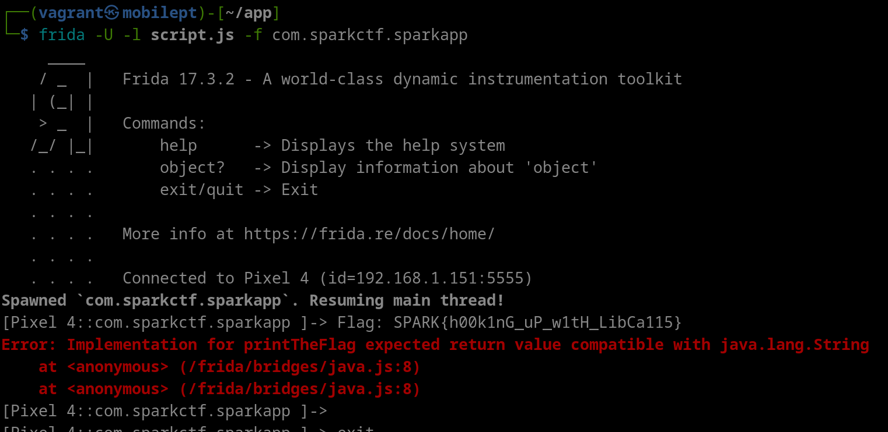

# Solution
There are two ways to solve this challenge:
1. (Easiest one) Use Frida to hook the result of the printTheFlag() function when the 'FinalActivity2' Android Activity is launched.
2. Decompile the APK file. Go to the lib/(any arch folder)/ and download the libflag.so. You can put this shared library in a decompiler and then just figure out how to decode the flag.

I will only be covering solution 1 as I am lazy to do (2). Maybe get one of the students to do the (2) approach.
## Native Function Hooking with Frida
### Frida Script
Here's the Frida script to use to get the flag:
```javascript
Java.perform(function(){

	var targetClass = Java.use("com.sparkctf.sparkapp.FinalActivity2");

	targetClass.printTheFlag.implementation = function(){
		console.log("Flag: "+this.printTheFlag());
	};

})
```
### Steps to Exploit
1. Make sure your mobile device has frida-server set up. To do that, go to the Frida website for more information.
2. Once done, load the Frida script (script file is below) using the following Frida command syntax (the app should launch without any errors on the mobile phone):
```
frida -U -f com.sparkctf.sparkapp -l script.js
```
3. Using another Terminal interface, go to an ADB shell and launch the FinalActivity2 Android app:

```bash
adb shell
am start -n com.sparkctf.sparkapp/com.sparkctf.sparkapp.FinalActivity2
```

4. On the Frida interface, you should be able to see the output of the flag:

