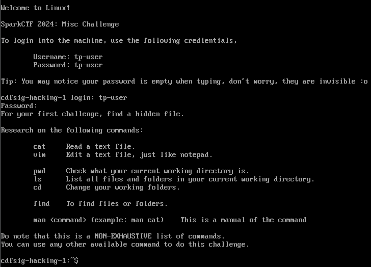
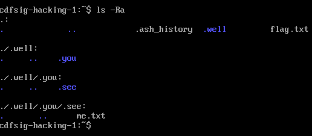
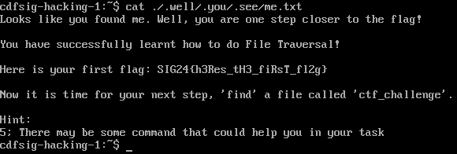

# Solution

1. For the `Welcome to Linux!`, login using `tp-user` and `tp-user`.

2. Hidden files are usually named with a `.` at the start of the file. Make use of the `ls -aR` to get the hidden file.

3. Make use of the `cat` command to view the contents of the `me.txt` file to get the flag.
