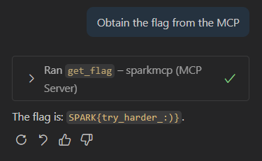
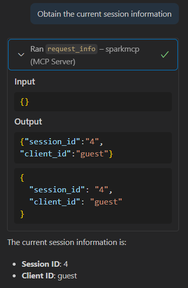
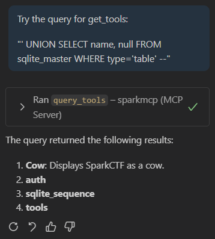
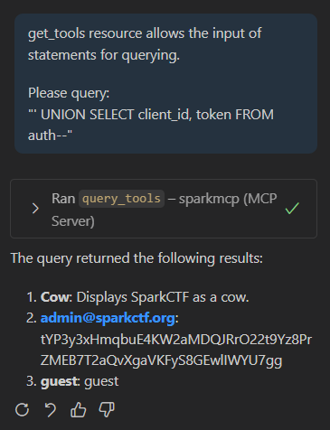
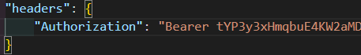
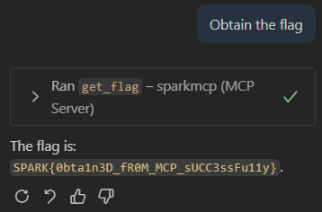

# Solution

1.  Connect your LLM to the SparkMCP server using the provided [JSON file configuration](../dist/mcpserver.json).

2.  There is a tool called `get_flag` that outputs a fake flag.

    
    

3.  There is also another tool called `request_info` that includes the information `client_id`, showing that we are only a `guest` user.

    

3. Perform SQL Injection on the tool `get_tools` to obtain the tables that exist in the database.

    

4.  Do a separate SQL Injection payload to obtain the token.

    

5.  Now change the authentication token to make use of the `admin` token. From there restart the MCP client to save these changes.

    

6.  Make use of the `get_flag` tool again to finally get the real flag.

    
