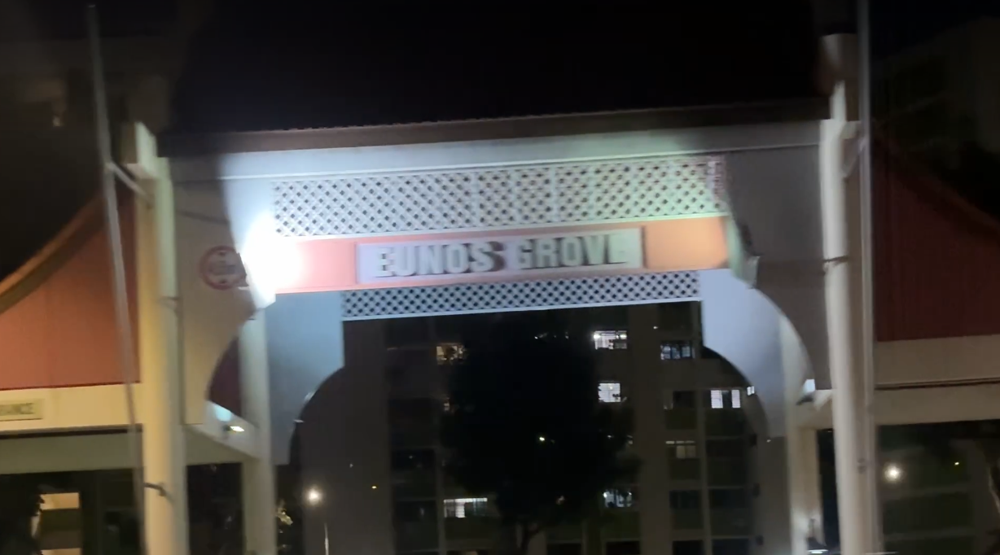
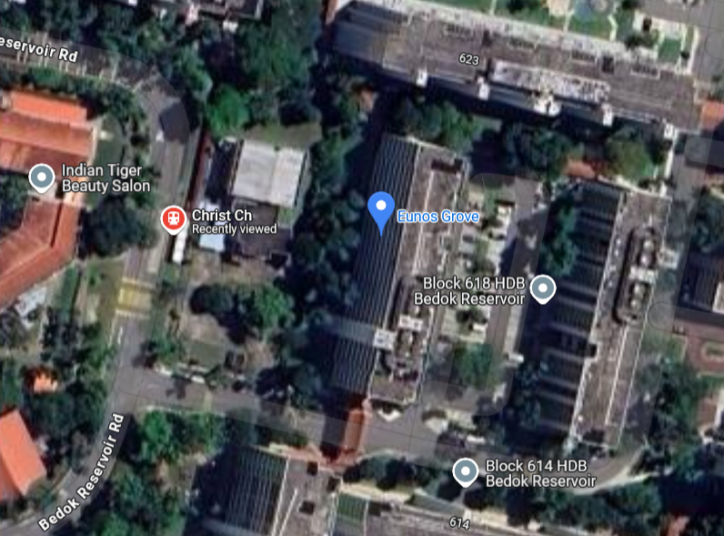
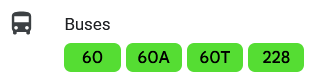

# Solution

1. At `0:06`, there is a text saying 'Eunos Grove'

2. Searching it on Google Maps shows a Bus Stop nearby

3. Going to the SBS Transit website for [Bus 60](https://www.sbstransit.com.sg/Service/BusService?ServiceType=Basic&ServiceNo=60) shows the last stop is Eunos Interchange.