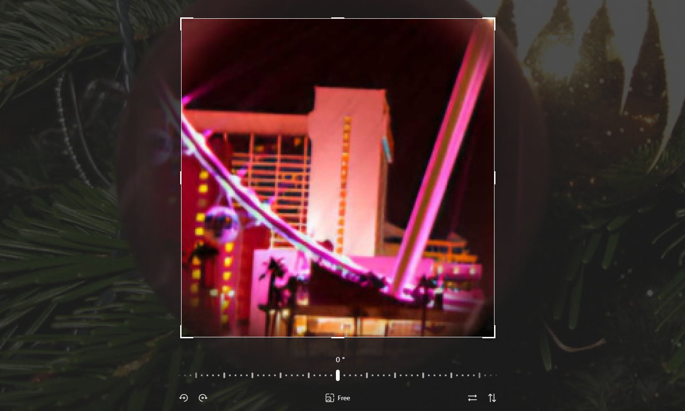
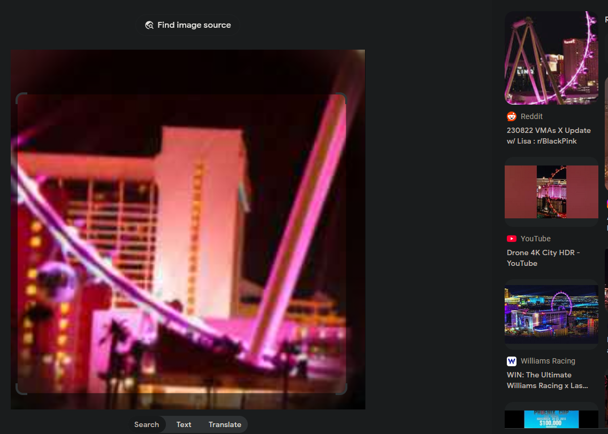
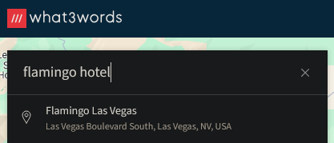
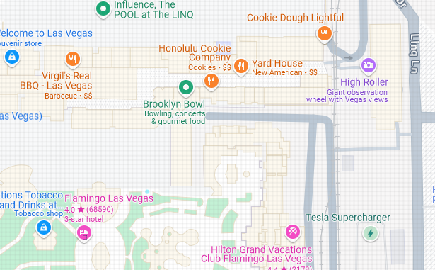
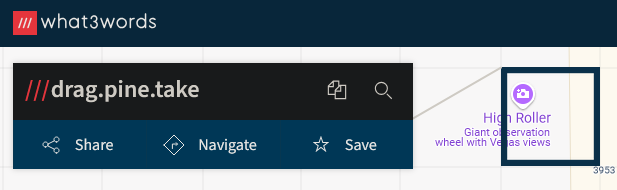

# Solution

1. Crop the image to only show the contents of the ornament 

2. Use a reverse search tool such as [Google Images](https://images.google.com/) to search the cropped image.

3. Now look at all of the results to deduce the location.

    For Example, one of the results was an [Instagram Post](https://www.instagram.com/bad_azz_yella_que/p/CvGoVnUtswL/) that showed information regarding a photo taken in Las Vegas.

    

    After that, we can make use of what3words to find the Hotel location.

    

4. Folloing the steps after locating where the Hotel is, now we need to deduce the location of the Ferris Wheel attraction, which should be nearby the Flamingo Hotel.

5. The High Roller matches the description of a Ferris Wheel, now we need the 3 words based off it's location. This is the flag.
