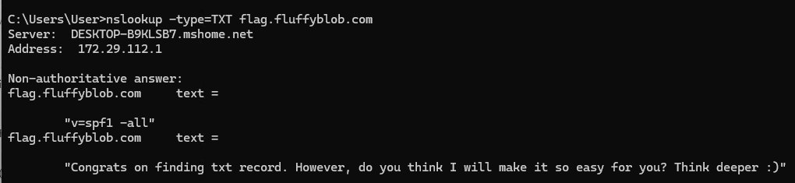
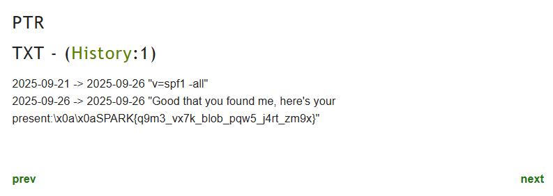

# LostDNS - Solution Writeup

## Challenge Overview

Participants must use historical DNS services to recover a deleted TXT record from flag.fluffyblob.com that contained a flag. The challenge tests knowledge of DNS txt records and historical data sources.

## Solution Steps [Do note there is more than 1 way to solve this challenge]

### Step 1: Initial DNS Investigation

Start by querying the target domain for current TXT records:

```bash
nslookup -type=TXT flag.fluffyblob.com
```

Or using dig:
```bash
dig TXT flag.fluffyblob.com
```

### Step 2: Analyze Current Results

The current DNS query reveals:
- SPF record: `"v=spf1 -all"`
- Hint record: `"Congrats on finding txt record However, do you think I will make it so easy for you? Think deeper :)"`


The record gives a hint that the participants is at the right place, but need to think deeper to get the actual flag. 

### Step 3: Historical DNS Research

The challenge description hints that "the internet never truly forgets anything" and mentions devices that "record your moves." This suggests using historical DNS services.

For the purpose of this, it will be done using `dnshistory.org`, but there are other alternatives tool available.

### Step 4: Query Historical Records

Navigate to DNSHistory.org and search for `flag.fluffyblob.com`:

1. Go to https://dnshistory.org/
2. Enter `flag.fluffyblob.com` in the search field
3. Look for the TXT records section
4. **Click on "History" link next to TXT records** to view historical changes
5. Examine the timeline of TXT record modifications

### Step 5: Locate Historical TXT Record

In the historical DNS data, locate the TXT record section which shows:

```
TXT - (History: 1)
2025-09-21 -> 2025-09-26 "v=spf1 -all"
2025-09-26 -> 2025-09-26 "Good that you found me, here's your present \x0a\x0aSPARK{q9m3_vx7k_blob_pqw5_j4rt_zm9x}"
```


The historical record reveals John's hidden message and the flag.

### Step 6: Extract the Flag

From the historical TXT record:
`"Good that you found me, here's your present \x0a\x0aSPARK{q9m3_vx7k_blob_pqw5_j4rt_zm9x}"`

**Flag:** `SPARK{q9m3_vx7k_blob_pqw5_j4rt_zm9x}`


## Key Learning Points

- Understanding that DNS changes are archived by various internet monitoring services
- Familiarity with historical DNS research tools and methodologies
- Recognition that "deleted" internet data often persists in archives
- Practical OSINT investigation techniques using publicly available resources
- DNS record types and their investigative value in digital forensics

