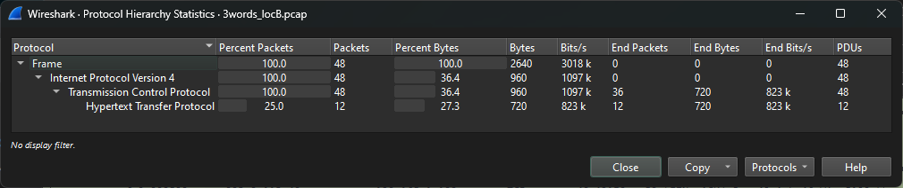
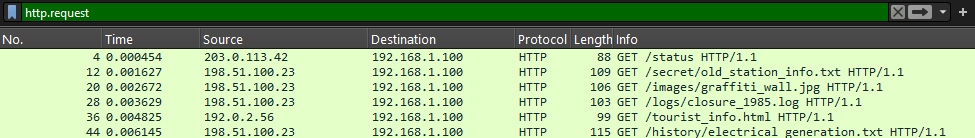
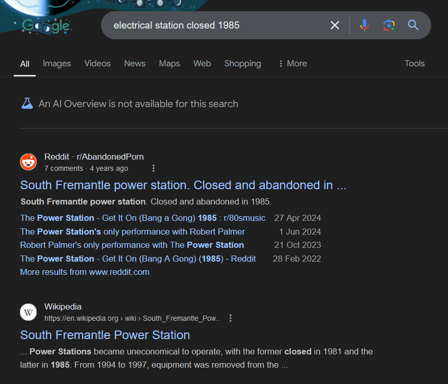
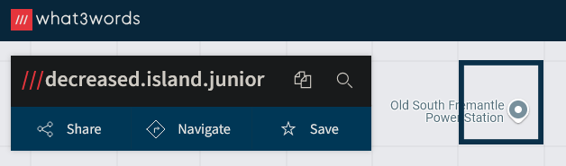

# Solution

1. Open up the PCAP file and check the Protocols that were used while the person was researching.

From the statistics, the focus will be more on the HTTP requests.

2. Filter only for HTTP requests by putting into the filter `http.request` OR `http.request.method` OR `http.request.method==GET`.

3. There are several requests to certain endpoints for a website.

    We can make use of the names of the endpoints to deduce the location.

4. Based off the endpoint names, we can deduce the following,
    - It is an Old Station, specifically a Electrical Generation Station
    - It was closed in 1985

5. Googling the following, `electrical station closed 1985` will result in the following [Google Search results](https://www.google.com/search?client=firefox-b-d&q=electrical+station+closed+1985)

    Based off these results, we can determine that the location is the **South Fremantle Power Station**

6. Now go to what3words to get the unique 3 word indicator for the location, which is your flag for this.
