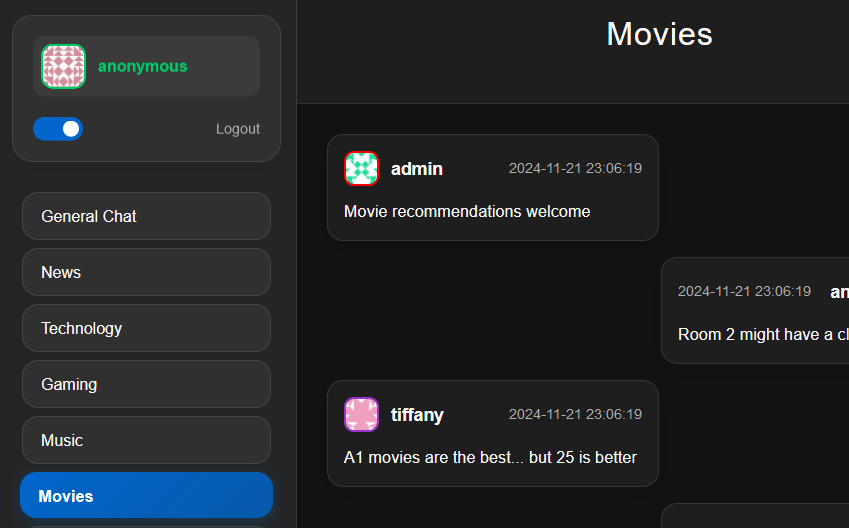
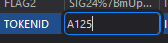
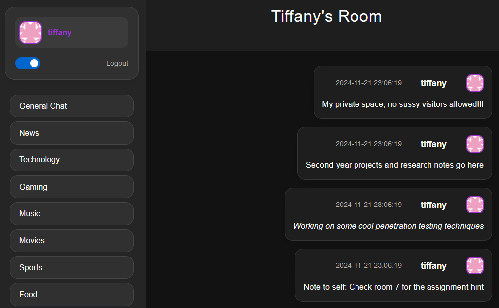
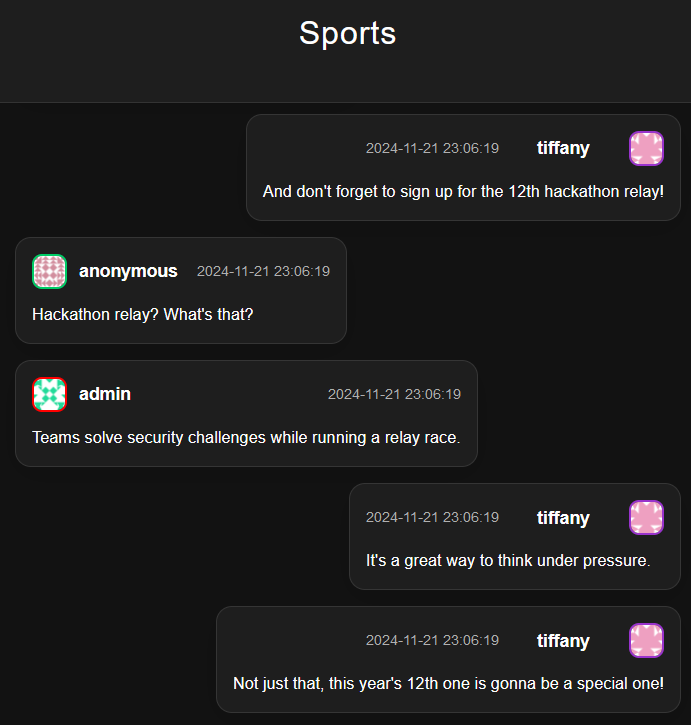
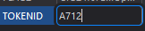

# Solution

1. There are several rooms with Hints that lead up to the Token for privilege escalation. One of the rooms is the Movies Room.

2. The Movies Chat has a message related to movies. There is a message that states `A1 movies are the best... but 25 is better`.

3. From there we can guess that the Session Token is probably `A125`. Inputting it as our cookie.\

4. Refreshing the page will escalate our user to Tiffany, allowing us to view her room.

5. We are given the hint to view the 7th Room.

6. In Room 7, we see the number '12' pop out a lot.

7. From there, we can assume that the Session Token to use is `A712`, `7` being the room number and `12` being the common number shown in Room 7. \

8. Refreshing once again escalates you to admin user. From there, enter the Admin room to get the Flag.