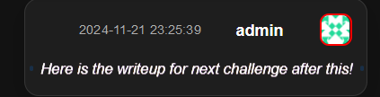
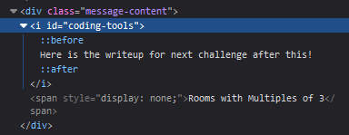

# Solution

1. The description of the challenge is stated in the Admin Room.

2. There is a message just above the description that is in italics. When hovering over, it will have an RGB effect on it.

3. When viewing using an element inspector, there seems to be a hidden message.

4. Using the hint given in the hidden message, go to Rooms 3, 6 and 9.

5. All of these rooms has one message which is in italics. Use inspect element on them to get the messages.

    In this case the hidden messages that were obtained are:
    - **Room 3:** ef92b778bafe771e89245b89ecbc08a44a4e166c06659911881f383d4473e94f
    - **Room 6:** There seems to be a hidden path under /index.php, which starts with 'sec...' and ends with '...deout', which has two words separated with a '_'
    - **Room 9:** When inputting the password, we use =. For example: /index.php?password=mypassword123

6. Use the [provided resource](https://10015.io/tools/sha256-encrypt-decrypt) and use their decrypter to decrypt the SHA256. It should return `password123`

7. Then after that, we can take it that the endpoint to use is 'secret_hideout'.

8. Now we can enter the secret hideout by entering, `/index.php?secret_hideout=password123`

9. From there, you can copy the flag.