# First Try Panic Solution

## 0. Reconnaissance

Before interacting with the challenge, we first identify the services running on the target server.

```bash
nmap -sV -p- <server-ip>
```

From the results, we find 2 interesting open ports:

Port 21 - FTP service

Port 35000 - Web application


## 1. Web enumeration
Accessing the web server via port 35000 only shows the default apache page. Users will need to do fuzzing to access the main page and search for hidden subdirectories. User should make use tools such as ffuf and gobuster as well as wordlists containing common subdomain names. 

```bash
ffuf -w path/to/SecLists/common.txt -u "http://<server-ip>:35000/FUZZ/"
```
    
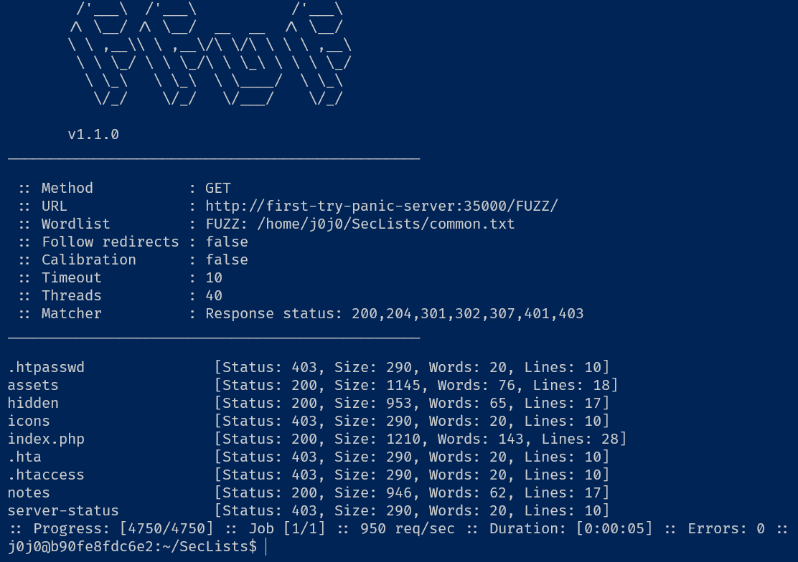

## 2. Website Exploration

After successful fuzzing, the main page of the website is discovered.

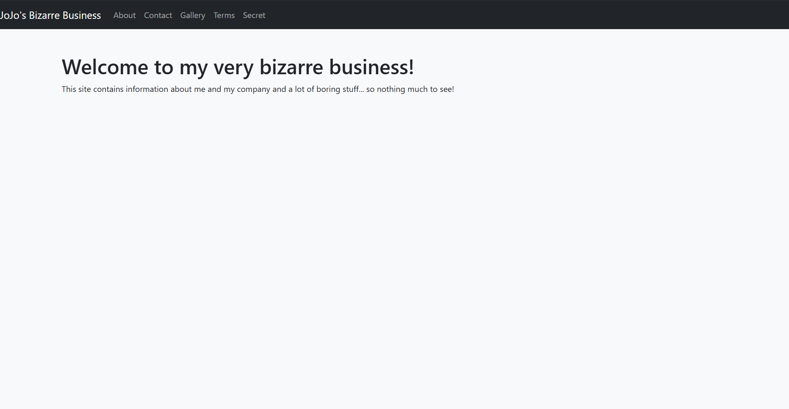

Users will need to navigate the website to find the FTP password hidden in various locations. Below are where you can find all the password snippets:

a) FTP username is found in contact.php: not_so_anonymous

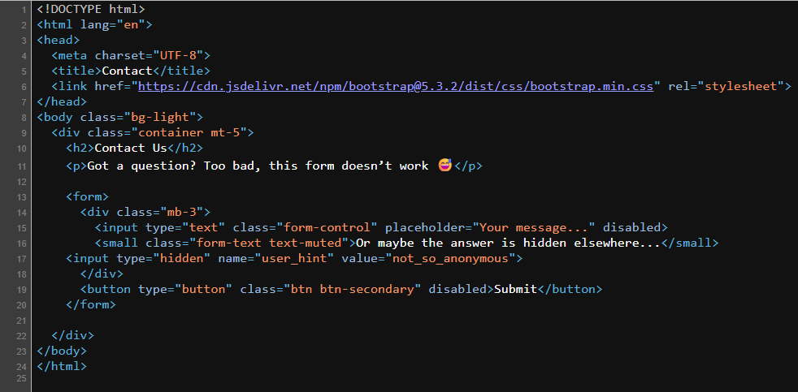

b) First part of FTP password is found in /assets/style.css : why4m

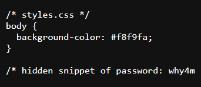

c) Second part of FTP password is found in /n07h3r3/definitelynothere.php: 1571llh3r3
    
You would first have to refer to robots.txt in order to find the /n07h3r3 directory

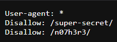

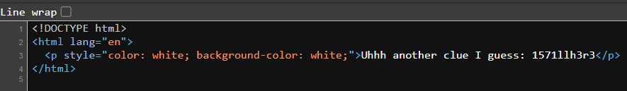

d) Third part of FTP password is found in secret.php: ju57705uf

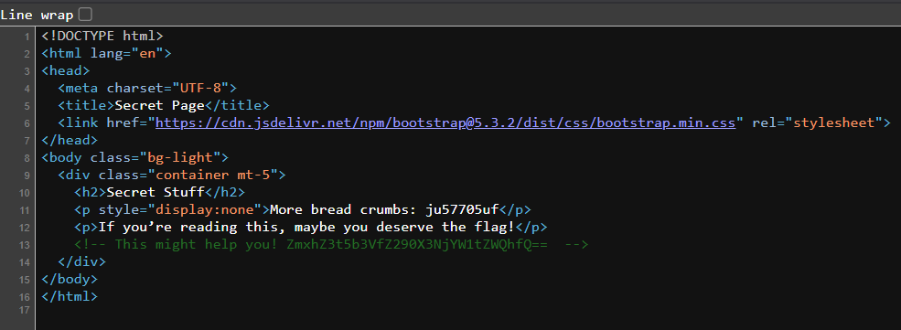

e) Fourth and final part of FTP password is found in /notes/note.txt: f3r1337

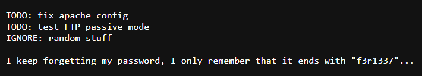

Connect to the FTP server: `ftp first-try-panic.sparkctf.org`

Username: `not_so_anonymous`
    
Password: `why4m1571llh3r3ju57705uff3r1337`

## 3. FTP Enumeration & Zip Extraction
Upon keying in the correct FTP credentials, 3 files appear in the home directory:

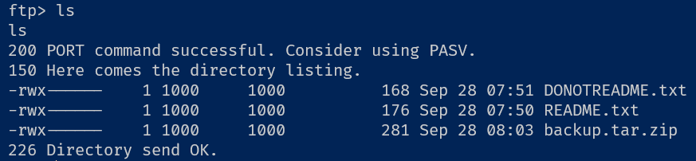

Use `get` to transfer all the files out.

`DONOTREADME.txt` and `README.txt` are files that provide clues to unlocking the `backup.tar.zip` file.

Both text files indicate that there is a clue hidden within the terms and conditions page on the website. Among the sea of text, useers have to find this line, which translates from latin to `The zip password is the reverse of the ftp password` 

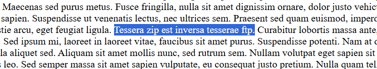

Users can use `rev` to reverse the string easily:

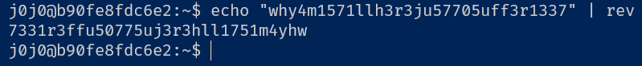

Zip file password: `7331r3ffu50775uj3r3hll1751m4yhw`


## 4. Retrieve the flag 
By unzipping the zip file with the reversed password (`unzip backup.tar.zip`), users can read the flag from the file.
   
   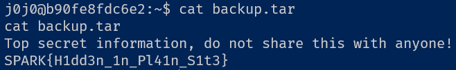
