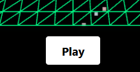
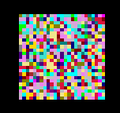
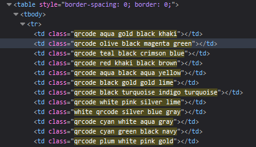
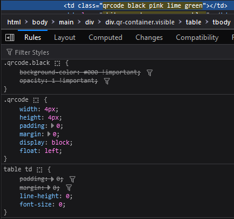
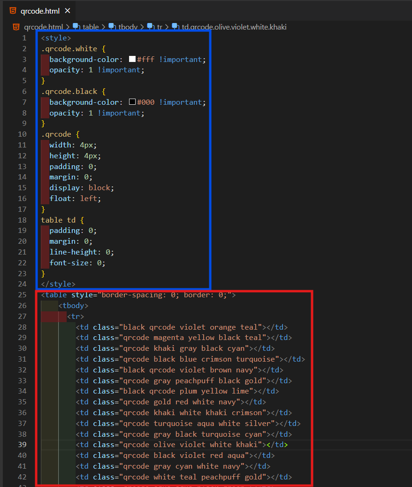

# Solution

1. Press the Play button

2. There seems to be a jumbled mess of colors at the bottom right of the screen, which changes at a fixed rate.

3. Using Inspect Element, there is a class that is named `qrcode`, indicating that it might be a QR Code.

4. Right click to **Edit as HTML** and extract the entire table.

5. Click on any of the `td` elements (on the website) and extract the relavent styles, `qrcode`, `table td`, `qrcode.black`, `qrcode.white`

6. Combine both the styles and QR Code table into one singlular HTML file.

7. Open up the HTML file, and scan the QR Code to get the flag
