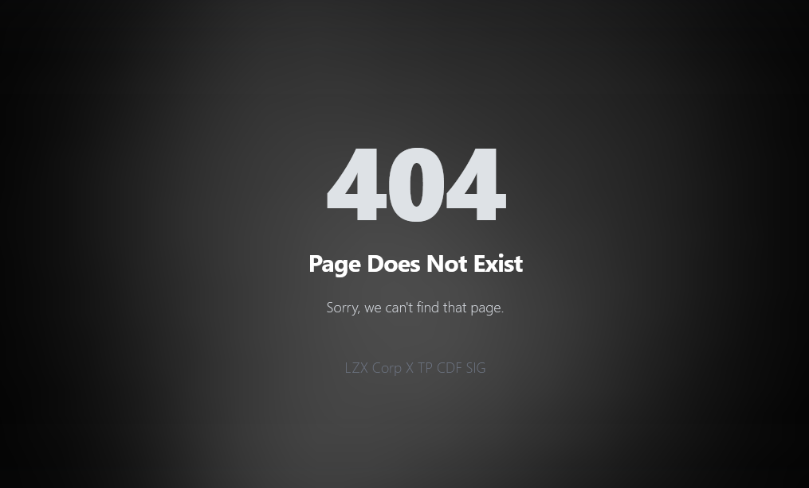
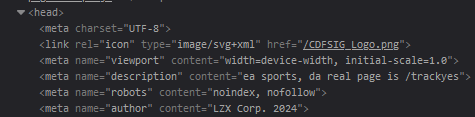
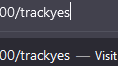

# Solution

1. You start off instantly with a 404 error message as the index page despite getting a HTTP 2XX status code when entering the website.

2. Doing an inspection on the header reveals a hidden path.

3. Put this as the path and you will get the flag at the bottom of the page
