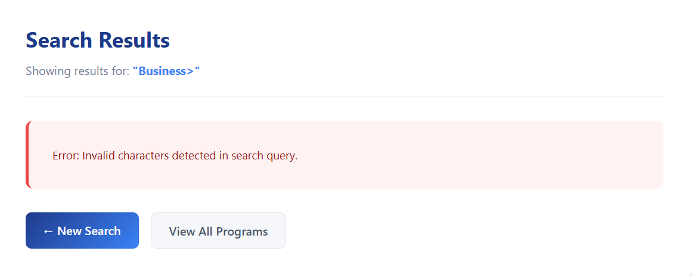
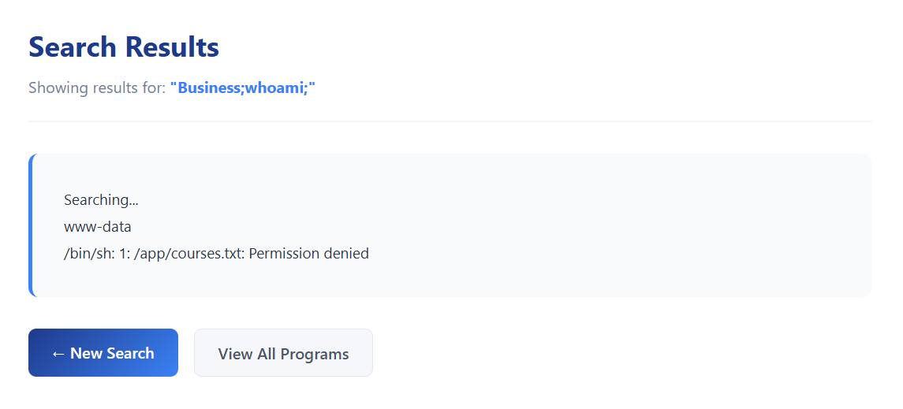
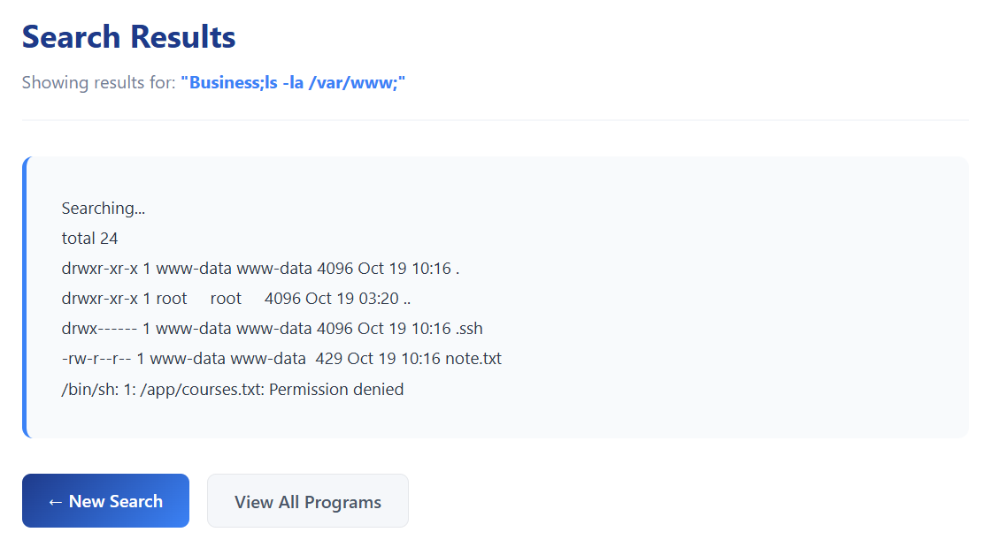
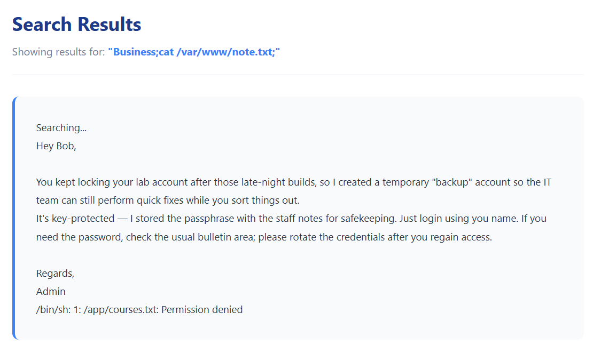
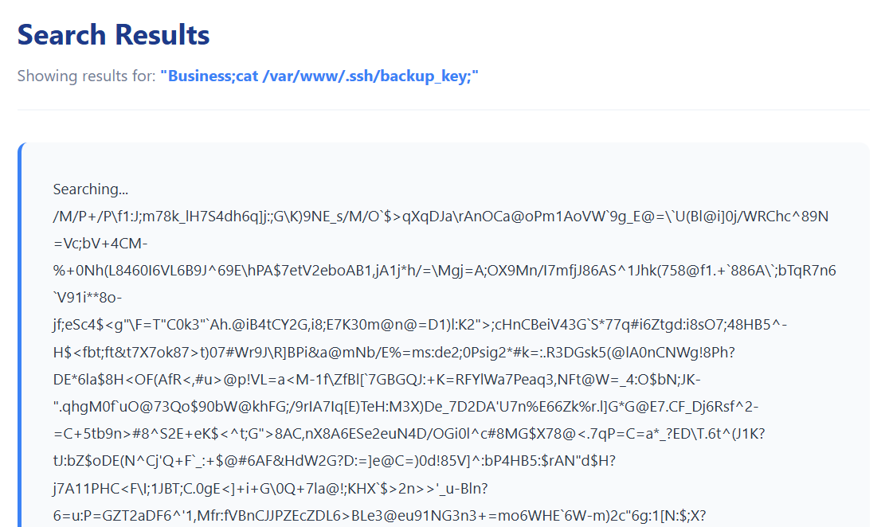
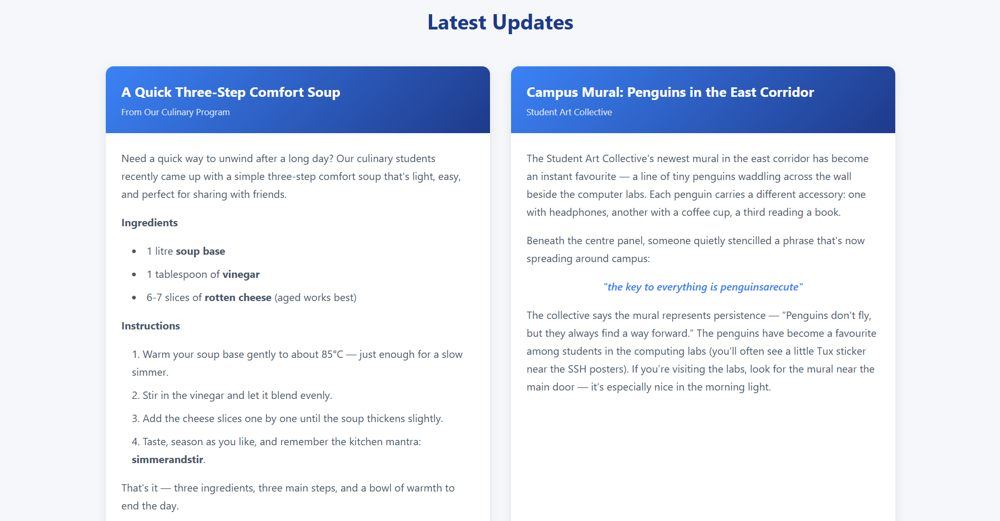
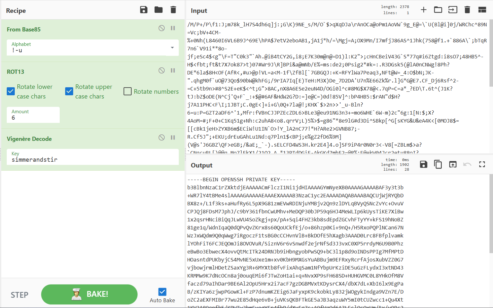

# Tamesak University - 1 Solution

## 0. Reconnaissance

Before interacting with the challenge, we first identify the services running on the target server.

```bash
nmap -sV -p- <server-ip>
```

From the results, we find 2 interesting open ports:

Port 8000 - hosting a web application

Port 2222 - running an SSH service on a non-standard port

---

## 1. Exploring the Website

Accessing the webpage at `http://<server-ip>:8000` brings you to a university website filled with information.


While browsing, you’ll notice a **Course Finder** button on the *Academics* page that leads to an interactive course-search tool.


---

## 2. Identifying the Injection Point

When performing a normal search, you’ll get relevant course names based on the similarity of your input.


Most symbols produce an error, **except for the semicolon (`;`)**, which allows arbitrary shell command injection.





---

## 3. Discovering Useful Files

Since commands can be executed on the host, we can explore the file system.  
A good place to start is `/var/www`, which commonly stores web application files.



Inside, we find two interesting items:

1. **A note** revealing that an SSH account named `bob` exists, but it requires an SSH key and password.  
   
   

2. **An SSH key file**, seemingly obfuscated using multiple layers of encoding.  
   
   

---

## 4. Decoding the SSH Key

The note suggests checking the **Announcements** section on the homepage.  
The posts there contain hints on how to decode the SSH key, as well as the password required to unlock it.



According to the “Cooking” post, the key must be decoded in the following order:

1. **Base85**
2. **Vigenère Cipher** (Key: `simmerandstir`)
3. **ROT Cipher** (Rotation of 6)

After applying these transformations, the decoded key is revealed.



---

## 5. Accessing the SSH Account

Save the decoded SSH key and connect to the server as **bob**:

```bash
ssh -i [decoded_key_name] bob@<server_ip> -p 2222
```

Once logged in, you can retrieve the flag from **Bob**’s home directory:
 
```bash
cat ~/flag1.txt
SPARK{n0t_s0_s3cr3t_k3y_b0b}
```