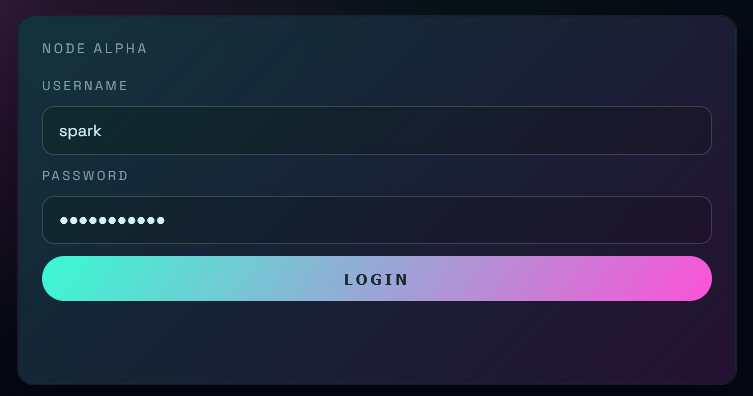
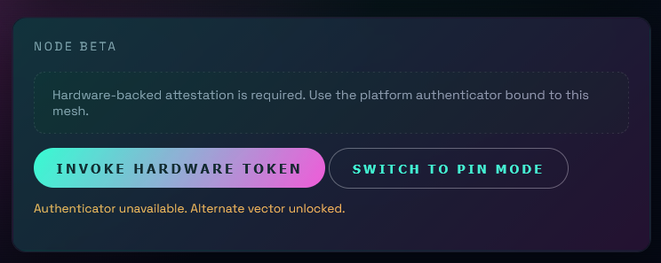

# Solution

1. The user had to guess the credientials for the user `spark` based on the [most common passwords list](https://en.wikipedia.org/wiki/List_of_the_most_common_passwords). [Password is: `password123`]


2. The website will make three attempts asking the user for a valid passkey. Ignoring all four attempts will give a prompt stating whether to use another method.


3. Choosing to use the other method, PIN, allows the user to type in a 4-digit PIN message. This can be found from the name of the challenge. [PIN is: `0004`].

4. Thus, successfully logging in and getting the flag as the user `spark`.

5. Decoding the JWT token in `user_session` gives the 2nd flag.
```json
{
  "sub": "spark",
  "challenge": "PROTOCOLSP4RK",
  "iat": 1763310228,
  "exp": 1763311128,
  "flag": "SPARK{3AS1lY_D0WNgr2d1ng_P1N}"
}
```